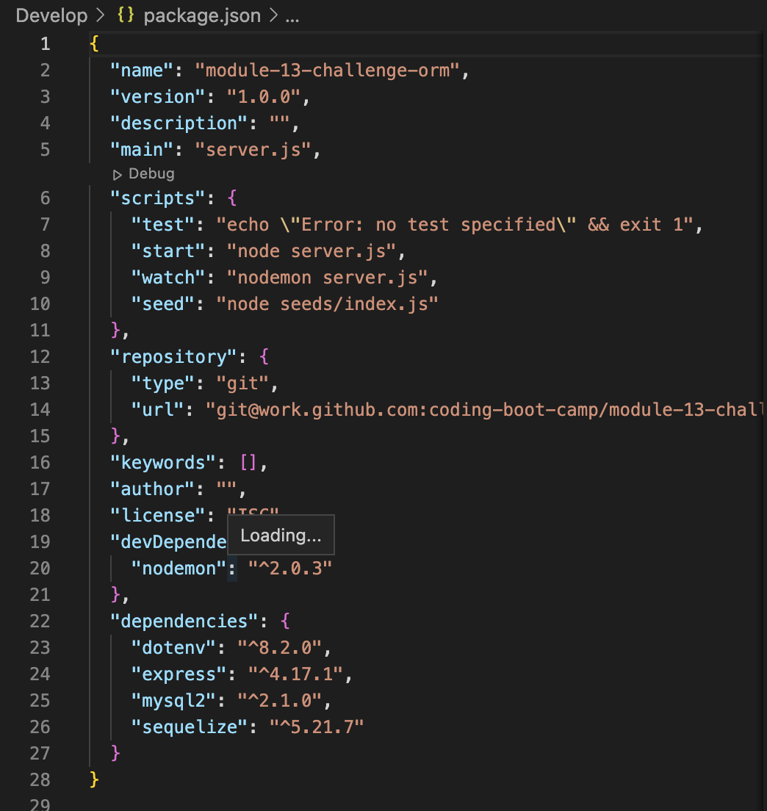

# E-commerce Back End 

## Description

Welcome to the e-commerce application built with modern web technologies! This platform leverages popular packages such as dotenv, Express.js, MySQL2, and Sequelize to provide the routes for a seamless shopping experience. The project features robust routes for Categories, Products, and Tags. You can browse, search, add, update, and delete products with ease, while enjoying the power of a relational database at your fingertips. Whether you're an admin managing your product catalog or a customer searching for the perfect item, this e-commerce platform is designed to meet your needs efficiently and effectively. Explore the routes to gain an idea of how to set up an E-Commerce back end. 

## Table of Contents 

- [Installation](#installation)
- [Usage](#usage)
- [Credits](#credits)
- [License](#license)
- [Badges](#badges)
- [Tests](#tests)
- [Questions](#questions)

## Installation

In order to get the environment to run, the user will need to install four packages: dotenv, Express.js, MySQL2, and Sequelize. Please ensure that versions 8.2.0 of dotenv, 4.17.1 of Express.js, 2.1.0 of MySQL2, and 5.21.7 of Sequelize. Importantly the user will need to begin with the command `npm init`, followed by `npm install dotenv@8.2.0`, `npm install express@4.17.1`, `npm install mysql2@2.1.0`, and `npm install sequelize@5.21.7`. 

## Usage

The user will need to setup their `.env` file which will contain DB_USER, DB_PASSWORD, and DB_NAME. Please ensure DB_USER is set to "root," allowing the user to access and manage the SQL database efficiently. The DB_NAME is `ecommerce_db`. Additionally, configuration of the database connection parameters in the project is crucial to ensure seamless functionality. DB_PASSWORD will need to be the password associated with the user's mysql account. 

After this setup, the user will need to change directories into the `db` folder and type in the following: `mysql -u root -p`. The user will then be prompted to type in their associated password. Next, type in `SOURCE schema.sql;` to setup the `ecommerce_db` for the repository. If the user wants to see an example of how the database works, the user can additionally change directories to the main Develop folder and run `npm run seed` to see how the database works with fake data. 

Once completed, the user will then be able to do `npm start` and begin utilizing the routes in an application such as Insomnia. 

[Tutorial](https://watch.screencastify.com/v/xSogs9P4Az1uhCkN2Cuf)

## Credits

David Montoto

## License

[Unlicensed](LICENSE)

## Badges

## Tests

N/A